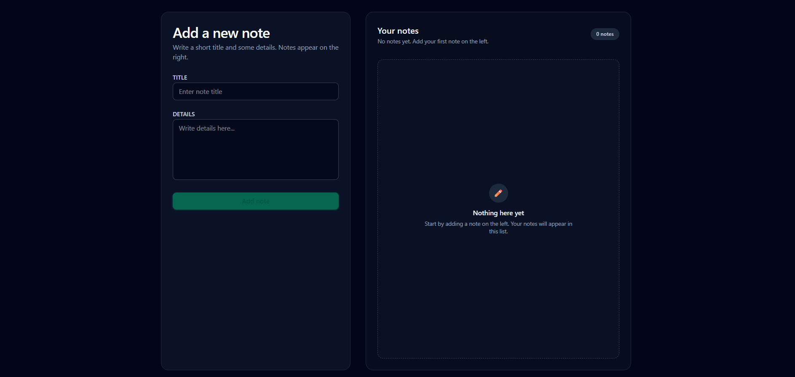

## 📝 Notes Studio — React Notes App

[](https://reactjs.org/)
[](https://vitejs.dev/)
[](https://tailwindcss.com/)

🚀 **Live Demo:** [Click here to view Notes Studio](notes-studio-o3qrodv9r-amrutas-projects-2a7a7151.vercel.app)



A clean and minimal Notes application built using **React + Tailwind CSS**.
Users can **add, edit, and delete notes** with instant UI updates — all powered by React state.

---

### 🚀 Features

✔ Add notes with custom title & description
✏️ Edit notes inline
🗑 Delete notes instantly
⚡ Instant state update (no reload needed)
📱 Fully responsive layout

---

### 🧠 Tech Stack

| Technology            | Usage                  |
| --------------------- | ---------------------- |
| **React (Hooks)**     | UI & State Management  |
| **Vite**              | Development & Build    |
| **Tailwind CSS**      | Utility-based styling  |
| **JavaScript (ES6+)** | Core Application Logic |

---

### 📌 Getting Started

```bash
# Install dependencies
npm install

# Run the development server
npm run dev
```

👉 Open the local link shown in the terminal (Default: `http://localhost:5173/`)

---

### 🏗 How It Works / Architecture

1. **Add Note:** Fill in the title and details, click "Add Note" → added to the notes list.
2. **Edit Note:** Click "Edit" on a note → form populates with note data → click "Update Note" to save changes.
3. **Delete Note:** Click "Delete" → removes the note instantly.

| Part              | Role                                 |
| ----------------- | ------------------------------------ |
| `useState`        | Manage input + notes + edit state    |
| `submitHandler()` | Adds / updates a note                |
| `editNote()`      | Loads existing note data for editing |
| `deleteNote()`    | Removes a note from state            |
| Component Layout  | Left → Form, Right → Notes List      |

---

### 🎯 What I Learned

* Implementing **CRUD** using React state
* Conditional rendering
* Rendering lists with `.map()`
* Handling forms & controlled components
* Responsive design in Tailwind CSS

---

### 🔮 Future Improvements

🔹 LocalStorage persistence
🔹 Search / Filter notes
🔹 Unique IDs for notes
🔹 Categories / Tags
🔹 Light ↔ Dark Mode theme

---

### 📚 License

This project is for **learning and portfolio building**.
Feel free to fork and enhance it! 😊
